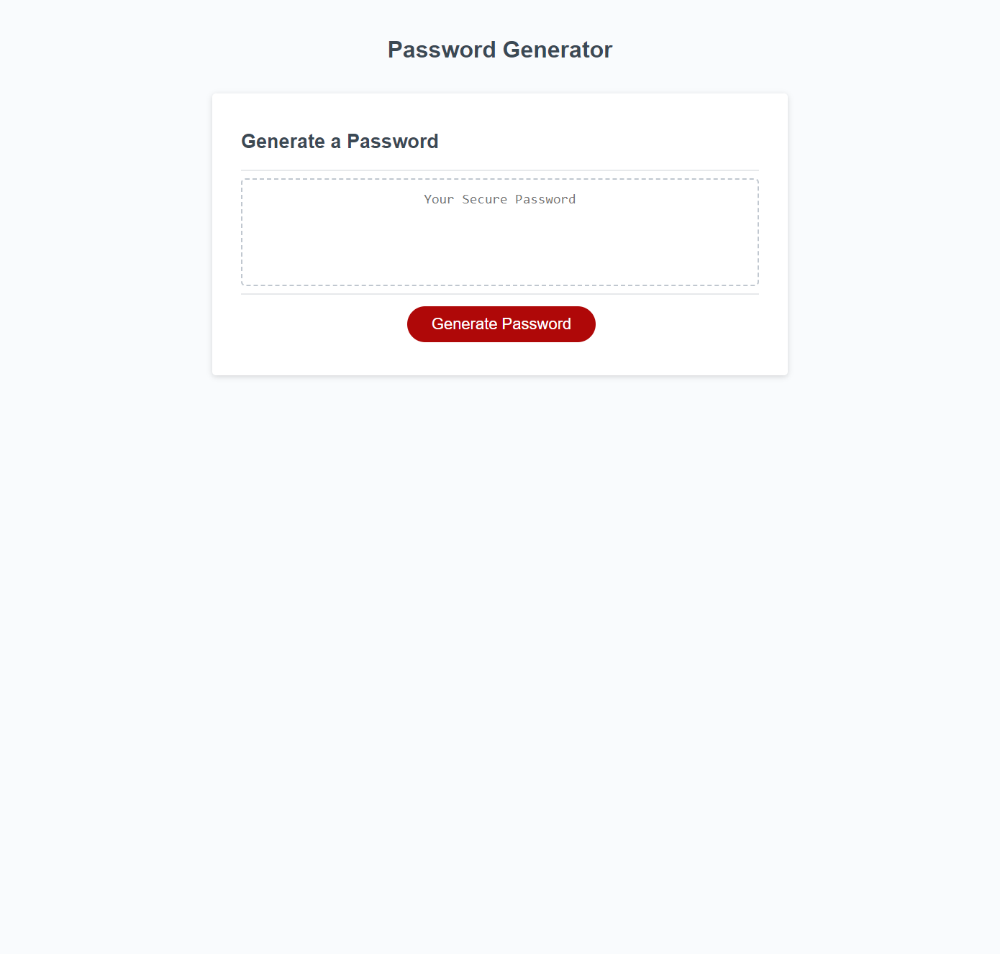

# password-generator-code-refactor

## Motivation

I made this password generator to help users come up with creative and secure passwords.

##  Project Overlook

## How to use

1. Click "Generate Password" button

2. Give a number length for your desired password 1-128

3. Select which types of characters to include in password

## Installation

N/A

## Credits

N/A

## License

Please refer to the license in the repository

## Link

https://carterm7272.github.io/password-generator-code-refactor/

